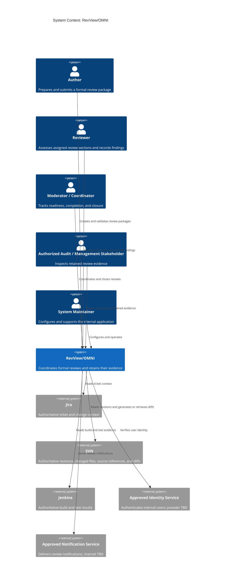
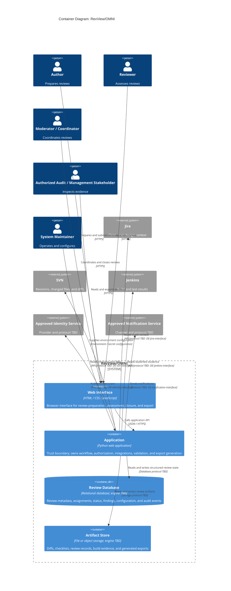

# Architectural Design

**Project:** RevView/OMNI  
**Team:** Team 8  
**Client:** Sumalee Rodolph, AppliedAvionics  
**Version:** 0.1

---

_This document is the architecture-of-record. It is breadth-complete and depth-shallow: it names every use case area, system boundary, container, external dependency, crosscutting convention, and expensive-to-reverse decision without designing endpoints, classes, or database columns._

## Identifiers

| Space | For |
|---|---|
| `KD-<slug>` | Key architectural decisions |
| `QS-<slug>` | Quality scenarios |
| `RISK-<slug>` | Technical risks |
| `TD-<slug>` | Technical debt |

## Revision History

| Version | Date | Author | Change |
|---|---|---|---|
| 0.1 | 2026-10-02 | Ralph Castilleja | Initial architecture-of-record for Checkpoint 1 |

---

## 1. Introduction and Goals

### 1.1 Requirements overview

The requirements overview is maintained in the [software requirements specification](../requirements/software-requirements-specification.md) and [use cases](../requirements/use-cases.md).

### 1.2 Quality goals

| Priority | Quality goal | Specification handles | Why it shapes the architecture |
|---|---|---|---|
| 1 | Review and source information stays within authorized review roles | `SEC-authenticated-access`, `SEC-participant-authorization`, `SEC-secrets-outside-repository` | Review packages contain internal source, ticket, build, and finding information; every entry path and integration must respect one trust boundary. |
| 2 | A package cannot appear complete when required evidence is missing, stale, or unavailable | `ROB-no-false-ready`, `INT-existing-artifact-export` | The application's business value depends on evidence integrity and audit-ready exports, so integrations must preserve provenance and failure state. |
| 3 | One designated maintainer can operate and adapt the delivered system | `CO-single-maintainer`, `MNT-externalized-integration-config` | The client expects a small post-handoff support footprint, so deployment and configuration must remain simple and centralized. |

### 1.3 Stakeholders

Stakeholders are profiled in [vision and scope section 3.1](../requirements/vision-and-scope.md#31-stakeholder-profiles).

## 2. Architecture Constraints

- `OE-internal-web`
- `OE-isolated-sandbox`
- `CO-existing-toolchain`
- `CO-no-student-production-access`
- `CO-export-existing-formats`
- `CO-single-maintainer`
- `DE-jira-interface`
- `DE-svn-interface`
- `DE-jenkins-interface`
- `DE-identity-interface`
- `DE-notification-interface`
- `AS-client-production-validation`

The identity and notification providers and their protocols are not yet confirmed, so they remain replaceable adapters rather than assumptions embedded in the application.

## 3. Context and Scope

RevView/OMNI owns review workflow state, assembled evidence references, findings, and exports. Jira, SVN, and Jenkins remain authoritative for the engineering records they already own.

## 4. Solution Strategy

- **One application deployable** (`KD-deployment-shape`) keeps operation within the capacity of one designated maintainer (`CO-single-maintainer`).
- **Modules follow the four use case areas** in section 5.2, with cross-cutting adapters for identity, integrations, notification, persistence, and export (`MNT-externalized-integration-config`).
- **The server application is the trust boundary** and performs authentication, authorization, validation, and evidence-readiness checks for every request (`SEC-authenticated-access`, `SEC-participant-authorization`, `ROB-no-false-ready`).
- **Jira, SVN, Jenkins, identity, and notification are accessed only through replaceable adapters**, allowing the isolated sandbox and production-approved implementations to differ without changing workflow code (`CO-no-student-production-access`).
- **Review metadata and review artifacts have separate persistence responsibilities**, allowing structured workflow queries while preserving diff, checklist, and export files (`INT-existing-artifact-export`).

## 5. Building Block View

### 5.1 Containers

The browser interface and server application are separated only by their runtime locations; the interface ships with the single application deployable. Review metadata and potentially large retained artifacts have separate storage responsibilities, but they remain owned and coordinated by the one application (`KD-deployment-shape`).

### 5.2 Use case areas and components

| Use case area | Component | Responsibility | Depends on | Status |
|---|---|---|---|---|
| `REV` | Review Preparation | Owns review creation, evidence assembly, and package-readiness validation | Integration Gateway, Artifact Management, Identity, Review Database, Jira, SVN, Jenkins | provisional |
| `NOT` | Review Coordination | Owns reviewer assignment state and notification attempts | Notification, Identity, Review Database | provisional |
| `ASS` | Review Assessment | Owns section assessments and findings tied to review evidence | Artifact Management, Identity, Review Database | provisional |
| `CLS` | Review Closure | Owns closure state and the retained evidence set for a completed review | Artifact Management, Export, Identity, Review Database | provisional |
| (cross-cutting) | Integration Gateway | Isolates workflow code from sandbox and production-specific engineering-tool interfaces | Jira, SVN, Jenkins | provisional |
| (cross-cutting) | Identity | Maps an authenticated internal identity to application roles and review assignments | Approved Identity Service | provisional |
| (cross-cutting) | Notification | Sends all reviewer and moderator notifications and records delivery outcome | Approved Notification Service | provisional |
| (cross-cutting) | Artifact Management | Stores and retrieves diffs, checklists, review records, and build evidence with provenance | Artifact Store, Review Database | provisional |
| (cross-cutting) | Export | Produces client-compatible Excel/CSV review records and checklists | Artifact Management, Review Database | provisional |
| (cross-cutting) | Audit | Records security- and workflow-significant actions | Identity, Review Database | provisional |

Checks: every use case area in `use-cases.md` (`REV`, `NOT`, `ASS`, `CLS`) has a row, and every external system in section 3 appears in a `Depends on` cell.

## 6. Runtime View

_Due at Checkpoint 2. Add a sequence diagram for the proving-slice use case after the implementation exists._

## 7. Deployment View

_Due at Checkpoint 3. Map every container to development and production hosts after the delivery pipeline exists._

## 8. Crosscutting Concepts

### 8.1 Security

**Trust boundary.** The Application container is the trust boundary. Browsers, Jira, SVN, Jenkins, the identity service, and the notification service are outside it; every request or response crossing that boundary is authenticated where applicable, authorized, validated, and treated as untrusted input.

**Authentication.** Every request for review data requires an identity verified through the AppliedAvionics-approved identity adapter (`SEC-authenticated-access`). The provider and protocol are deliberately unresolved until the client confirms them (`DE-identity-interface`); no application password scheme is assumed.

**Authorization.** Authors, Reviewers, Moderators or Coordinators, and authorized audit or management stakeholders receive only actions and review content allowed by their role and review assignment (`SEC-participant-authorization`). The exact role matrix must be confirmed before implementation; denial is the default when no rule grants access.

**Sensitive data.** Ticket context, source and diff content, build evidence, review findings, identities, and retained audit evidence are sensitive. They live only in the Review Database and Artifact Store and are disclosed externally only to the engineering systems needed to retrieve them; notification content should carry a review reference rather than source content. Retention and disposal periods remain a client decision for specification section 7.4. Secrets are supplied outside the repository through environment-specific secret configuration (`SEC-secrets-outside-repository`).

### 8.2 Other concepts

**8.2.1 Error handling.** Every application failure is translated once at the trust boundary into a stable error code and safe message, while integration failures retain the name of the unavailable source; this prevents exception details from leaking and lets every screen handle failures consistently. Shown in: not yet implemented.

**8.2.2 Time and time zones.** Persist timestamps in UTC, display them in one configured organization time zone, and obtain current time through a replaceable clock; this keeps audit ordering deterministic and tests independent of a developer's machine. Shown in: not yet implemented.

**8.2.3 API conventions.** Browser-to-application APIs use versioned JSON resources and one success/error envelope, with nouns representing review resources and HTTP methods representing actions; this prevents each use case area from inventing an incompatible interface. Shown in: not yet implemented.

**8.2.4 Code conventions.** Organize application code by the use case areas in section 5.2 and require external tools to be reached through adapter interfaces; this keeps production-only details out of workflow logic. Shown in: not yet implemented.

**8.2.5 Validation.** The Application performs the authoritative validation before state changes or export, while browser checks are convenience only; this prevents direct API calls from bypassing completeness and authorization rules. Shown in: not yet implemented.

**8.2.6 Configuration and secrets.** Load environment-specific endpoints, feature settings, and secret references at startup, reject missing required settings, and never commit credential values; this supports sandbox/production separation and one-maintainer operation. Shown in: not yet implemented.

**8.2.7 Logging.** Emit structured operational logs with request and review correlation identifiers, but never log credentials, tokens, source or diff content, or exported artifacts; this supports diagnosis without creating a second evidence leak. Shown in: not yet implemented.

**8.2.8 Persistence and concurrency.** Complete each workflow state change in one application transaction and reject an update based on a stale review version; this prevents two participants from silently overwriting review state. Shown in: not yet implemented.

**8.2.9 Auditing.** Record the authenticated actor, action, review identifier, result, and UTC time for every assignment, readiness, assessment, finding, export, and closure transition; this preserves who changed what without placing sensitive artifact content in the audit event. Shown in: not yet implemented.

**8.2.10 Testing.** Test workflow rules against synthetic data, contract-test each external adapter against its sandbox, and keep production validation with AppliedAvionics personnel; this respects the production-access constraint while exposing interface mismatches early. Shown in: not yet implemented.

## 9. Architecture Decisions

### 9.1 Architecturally significant requirements

| Rank | Requirement | Specification handles | Importance × difficulty | Drives |
|---|---|---|---|---|
| 1 | Authenticate and authorize every review-data request | `SEC-authenticated-access`, `SEC-participant-authorization` | High × High | Trust boundary, Identity component, server-side validation |
| 2 | Never present incomplete or unavailable evidence as ready | `ROB-no-false-ready` | High × High | Integration Gateway, Artifact Management, readiness state |
| 3 | Preserve existing review-record and checklist formats | `INT-existing-artifact-export`, `CO-export-existing-formats` | High × Medium | Artifact Store and Export component |
| 4 | Keep sandbox and production configuration replaceable | `MNT-externalized-integration-config`, `CO-no-student-production-access` | High × Medium | Adapter boundaries and external secret configuration |
| 5 | Remain operable by one designated maintainer | `CO-single-maintainer` | Medium × Medium | `KD-deployment-shape` |

### 9.2 Key decisions

**`KD-deployment-shape`: one application deployable.** _Accepted._

- **Driving requirements:** `CO-single-maintainer`, `MNT-externalized-integration-config`, `CO-no-student-production-access`.
- **Context:** RevView/OMNI serves a small internal engineering group, must be handed to one designated maintainer, and has no documented independent-scaling requirement for any use case area.
- **Decision:** Package the Python server application and its browser assets as one deployable. Keep Review Preparation, Coordination, Assessment, Closure, and cross-cutting services as modules inside it. Use one relational review database and one artifact-storage responsibility, with their specific engines selected after the client's approved environment is known.
- **Rejected:** Separate deployable services for each use case area. They would add service-to-service authentication, distributed failure modes, multiple deployment pipelines, and more operational work without a requirement that benefits from independent deployment or scaling.
- **Trade-off:** The application deploys and scales as a unit, and a failed deployment can affect every workflow area; module boundaries and adapter contracts must therefore be enforced in code and tests rather than by network separation.

## 10. Quality Requirements

### 10.1 Quality requirements overview

See [section 9 of the software requirements specification](../requirements/software-requirements-specification.md#9-quality-attributes).

### 10.2 Quality scenarios

_Due at Checkpoint 2. Add one scenario for each top-ranked requirement as tests become available._

## 11. Risks and Technical Debt

_Due at Checkpoint 2. Seed this table from unresolved interface, identity, retention, and production-validation questions before implementing the proving slice._

## 12. Glossary

Domain terms are defined in the [project glossary](../requirements/project-glossary.md).

---

## Working this document with an agent

Before implementation, verify that every cited identifier exists, every use case area has a component, every external system has an owning adapter, and every new container is forced by a requirement in section 9.1. Do not add endpoints, classes, database columns, or new deployment services here; those belong in the design-of-record for a proving slice.
