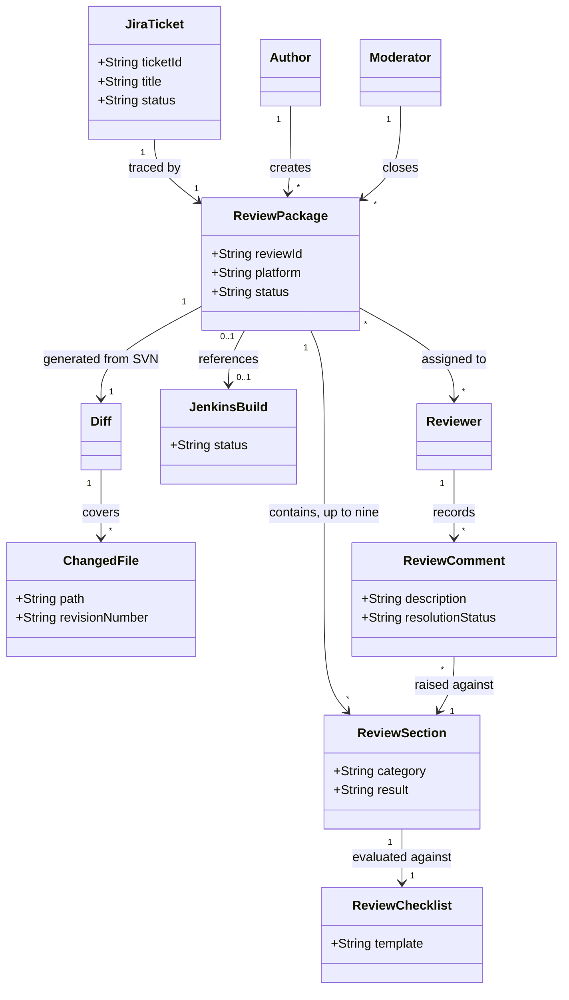

# Software Requirements Specification

**Project:** RevView/OMNI
**Team:** Team 8
**Client:** Sumalee Rodolph, AppliedAvionics
**Version:** 0.3

---

_**How to use this template.** Instructions appear in italic square brackets. Fill in underneath them and leave them in place until the document is stable._

_**What this document is, and what it is not.** The specification describes the external behavior of your system completely enough that a developer can build it and a tester can check it. What it is **not** is a container for everything you have written. Your glossary, vision and scope, use cases, and business rules are separate documents with their own identifiers, and this one **links to them rather than repeating them**._

_That makes the specification mostly a hub. Read that as a feature. One fact, one home: a business rule copied in here is a business rule that will disagree with `business-rules.md` by October, and nobody will notice which copy is right. The sections below that say "link to" are supposed to be short._

_What this document owns outright: the requirements that have no other home. Functional requirements that are not part of any use case, quality attributes, external interfaces, data requirements, operating environment, and constraints._

## Identifiers

_Every requirement in this document carries a name-based slug. Create only the spaces your project actually needs._

| Space | For | Example |
|---|---|---|
| `FR-<AREA>-<slug>` | Functional requirements outside any use case | `FR-SAVE-autosave-active` |
| `UI-<slug>` | User interface requirements | `UI-spa-views` |
| `SI-<slug>` | Software and system interfaces | `SI-llm-proxy-only` |
| `CI-<slug>` | Communications interfaces | `CI-email-notifications` |
| `DI-<slug>` | Data requirements | `DI-persist-graph` |
| `OE-<slug>` | Operating environment | `OE-supported-browsers` |
| `CO-<slug>` | Design and implementation constraints | `CO-single-application` |
| `AS-<slug>` / `DE-<slug>` | Assumptions and dependencies | `AS-supported-browser`, `DE-llm-service` |

_Quality attributes get one space per attribute, so the identifier says which kind of quality it is at the place it is cited: `USE-` usability, `PER-` performance, `SEC-` security, `SAF-` safety, `AVL-` availability, `ROB-` robustness, `SCA-` scalability, `INT-` interoperability, `MNT-` maintainability._

_Requirements cited from elsewhere keep their own identifiers: `UC-*` from [use-cases.md](use-cases.md), `BR-*` from [business-rules.md](business-rules.md), `BO-*`, `SM-*`, `FEAT-*` from [vision-and-scope.md](vision-and-scope.md)._

## Revision History

| Date | Version | Description | Author |
|---|---|---|---|
| 2026-09-25 | 0.1 | Initial draft of section 1, from vision-and-scope.md and the client interview notes | Oleh Zubariev |
| 2026-09-25 | 0.1 | Updated section 1 to match the filled-in vision-and-scope.md sections 2 through 4 | Oleh Zubariev |
| 2026-10-02 | 0.2 | Added identifiers for the C4 context, containers, and external-system interfaces | Ralph Castilleja |
| 2026-10-04 | 0.3 | Filled in sections 2 through 11; merged with the section 2.5, 8.3, 8.5, and 9.3 content from PR #16 | Oleh Zubariev |

---

## 1. Introduction

### 1.1 The purpose of RevView/OMNI

RevView/OMNI is proposed for an internal aerospace software engineering team, at AppliedAvionics, that conducts formal code reviews for safety-critical avionics software. Today, authors manually assemble review information across Jira, SVN, and Jenkins, and complete separate checklists and review records, before a review can begin, and reviewers then move between those same materials to assess a change. This recurring administrative work takes time away from engineering assessment and creates opportunities for incomplete reviews, outdated source code under review, and missed reviewer notifications (see [vision-and-scope.md](vision-and-scope.md) sections 1.1, 1.2, and 2.1).

RevView/OMNI consolidates the review record, source and diff context, checklists, and build information into a single review workspace, so that authors, reviewers, and the review moderator or coordinator, the primary user classes described in [vision-and-scope.md](vision-and-scope.md) section 3.1, spend their time on the review itself rather than on assembling it. The application supports the current safety-critical review process but is not itself a safety-critical system; it is a coordination and evidence-management tool for the review workflow.

The project also serves as a senior design project for TCU students, who work with AppliedAvionics engineers to build it. Because students cannot access AppliedAvionics' production network, development uses isolated instances of Jira, SVN, and Jenkins populated with synthetic data, and AppliedAvionics' own software team validates the integrations against its production systems before the application is deployed internally.

### 1.2 The purpose of this document

This document describes the functional and nonfunctional requirements for RevView/OMNI. It serves as the reference for the project's requirements, defining the scope, functionality, and constraints for AppliedAvionics, the development team, and the course instructors.

This specification supports the MVP scope defined in [vision-and-scope.md](vision-and-scope.md) section 4.3: `FEAT-review-initiation`, `FEAT-context-assembly`, `FEAT-diff-and-source-prep`, `FEAT-checklist-mapping`, `FEAT-integrity-validation`, `FEAT-review-notification`, and `FEAT-evidence-retention`. `FEAT-admin-and-configuration`, AI-generated review summarization beyond assisting with evidence assembly, and full production-grade integration across every platform variant are explicitly out of scope for this release, for the reasons given in that section.

### 1.3 Document conventions

This document uses the identifier spaces listed under Identifiers above. Functional requirements that do not belong to a use case are written using the EARS (Easy Approach to Requirements Syntax) sentence shapes described in section 5.2, so that each one can be read only one way.

### 1.4 References

- [Project glossary](project-glossary.md)
- [Vision and scope](vision-and-scope.md)
- [Use cases](use-cases.md)
- [Business rules](business-rules.md)
- [Open issues](OPEN-ISSUES.md)
- [Client interview, 2026-09-09](client-meeting/client-interview-2026-09-09.md)
- [Client interview, 2026-09-18](client-meeting/client-interview-2026-09-18.md)
- [The Easy Approach to Requirements Syntax (EARS)](https://alistairmavin.com/ears/)

---

## 2. Overall Description

### 2.1 Product perspective

RevView/OMNI is an internal coordination and evidence-management application, not a standalone system of record. It sits beside AppliedAvionics' existing Jira, SVN, and Jenkins and organizes the information from them into a review-specific package; it does not replace any of the three. The product perspective is maintained in [vision-and-scope.md](vision-and-scope.md) section 4.1; the C4 context diagram is maintained in [architectural-design.md](../design/architectural-design.md) section 3.

### 2.2 User classes and characteristics

User classes are profiled in [vision-and-scope.md](vision-and-scope.md) section 3.1. The classes that affect software behavior, specifically access control, are the three review participant roles defined in [project-glossary.md](project-glossary.md):

- **Author**: creates a review package, has full read and write access to it before and during review, and remains responsible for the engineering rationale behind each change (glossary: Author).
- **Reviewer**: assigned to one or more review packages, with read access to the package's diff, source context, checklist, and build results, and write access to assessment results and review comments for the sections assigned (glossary: Reviewer).
- **Moderator**: coordinates the review and initiates closure once required checklists are submitted (glossary: Moderator).

The glossary itself flags the Moderator's complete permissions, and whether an Author or Reviewer may also act as Moderator on the same review, as unconfirmed with the client. That gap blocks a precise access-control design for closure actions and had not been promoted to a tracked question; raised now as `OI-15`.

The sponsor, internal quality or audit stakeholder, system maintainer, and student development team (vision-and-scope.md section 3.1) are stakeholders but not system users, so they do not need an access class here.

### 2.3 Operating environment

No operating-environment requirement, hardware, operating system, browser, hosting location, or coexisting software, has been stated by AppliedAvionics. The only environment-shaping facts the team has are indirect: the system is a web application (client interview, 2026-09-09; vision-and-scope.md section 2.1), and during development it runs against the sandbox described in vision-and-scope.md section 4.1 rather than AppliedAvionics' network.

Two gaps are significant enough to raise rather than assume:

- Where the system may be hosted, and whether any browser, OS, or network-access requirement applies, is undetermined. Raised as `OI-18`.
- Because AppliedAvionics manufactures avionics hardware, the team does not know whether export-control, data-residency, or hosting restrictions (for example ITAR) apply to the system or its data, in development or in production. This has not come up in either client meeting. Raised as `OI-17`.

### 2.4 Design and implementation constraints

- `CO-backend-language`: The backend shall be written in Python (client interview, 2026-09-09, section 9).
- `CO-frontend-language`: The frontend shall be written in JavaScript (client interview, 2026-09-09, section 9).
- `CO-sandbox-development`: Until production handoff, the system shall be built and tested only against the sandbox Jira, SVN, and Jenkins instances described in vision-and-scope.md section 4.1, never AppliedAvionics' production network (`BR-no-student-prod-access`, [business-rules.md](business-rules.md) section 2.3).
- `CO-export-format-preserved`: Review records and checklists shall remain exportable in the existing Excel/CSV format AppliedAvionics uses today (`BR-review-package-exportable`, business-rules.md section 2.1).
- `CO-public-repository`: The system is developed in the team's own GitHub repository, which may be public (client interview, 2026-09-09, section 9). Consequently `SEC-no-production-credentials-in-development` (section 9.3) is a hard requirement rather than a convenience, since a secret committed to the repository could be exposed publicly.

Who maintains this after the team graduates: Sumalee Rodolph, documented as `MNT-single-maintainer` in section 9.7. That requirement is the source of the Python and JavaScript constraints above; a stack she cannot run alone would violate it even if it were otherwise reasonable.

### 2.5 Assumptions and dependencies

Business-level assumptions and dependencies (`AS-*`) are maintained in [vision-and-scope.md](vision-and-scope.md) section 2.7: `AS-jira-access`, `AS-svn-access`, `AS-jenkins-access`, `AS-review-forms`, `AS-isolated-environment`, `AS-sponsor-validation`. This section adds the dependencies specific to building and integrating the system itself. The sandbox-specific entries below are additions to, not replacements for, the general interface dependencies already here:

- `DE-sandbox-jira-seat-limit`: The sandbox Jira instance depends on Atlassian's free tier, which supports up to ten users at no cost (vision-and-scope.md section 1.3, reference R1, section 12.3). The student team and sponsor accounts must fit within that limit.
- `DE-sandbox-self-hosted-svn-jenkins`: The sandbox SVN and Jenkins instances depend on the team self-hosting them on a small cloud or university-provided VM (same reference, section 12.3); their availability is the team's own responsibility, not AppliedAvionics'.
- `DE-jira-interface`: Review context assembly depends on an approved read interface to the applicable Jira instance.
- `DE-svn-interface`: File, revision, and diff assembly depends on an approved read interface to the applicable SVN instance.
- `DE-jenkins-interface`: Build and test evidence depends on an approved read interface to the applicable Jenkins instance.
- `DE-identity-interface`: Authenticated internal access depends on an AppliedAvionics-approved identity mechanism; the exact provider and protocol are not yet confirmed. Whether AppliedAvionics provides one at all, rather than the team needing its own account system, is unconfirmed; raised as `OI-21`.
- `DE-notification-interface`: Reviewer notification depends on an AppliedAvionics-approved email or messaging service; the exact channel and protocol are not yet confirmed.

---

## 3. Project Glossary

The glossary is [project-glossary.md](project-glossary.md).

## 4. Vision and Scope

Business requirements, objectives, metrics, and scope live in [vision-and-scope.md](vision-and-scope.md).

---

## 5. Functional Requirements

### 5.1 Use cases

Most of the system's behavior is specified in [use-cases.md](use-cases.md) and is not restated here.

### 5.2 Non-use-case functional requirements

**Export**

`FR-EXPORT-legacy-format`: Where a review record or checklist is exported, the system shall produce it in the existing Excel/CSV format AppliedAvionics uses today (`BR-review-package-exportable`, business-rules.md section 2.1; `CO-export-format-preserved`, section 2.4). Verified by: the exported file opens in the spreadsheet tooling AppliedAvionics already uses and carries the same fields as today's manual review package.

**Audit logging**

`FR-AUDIT-action-log`: The system shall record who performed every status-changing action on a review package, creation, validation, notification, section assessment, and closure, together with a timestamp, supporting `SM-audit-coverage` (vision-and-scope.md section 2.3) and the Traceability concept (project-glossary.md). Verified by: querying a review package's history returns a complete, chronologically ordered action log.

**Reviewer and Jira synchronization**

`FR-SYNC-reviewer-bidirectional`: When a reviewer is added to a review package in RevView/OMNI, the system shall add that reviewer to the review's associated Jira ticket. When a reviewer is added to the Jira ticket directly, the system shall notify that reviewer in RevView/OMNI (project-glossary.md, Reviewer Assignment; vision-and-scope.md section 1.3, reference R1, section 8). Verified by: adding a reviewer on either side and confirming the other side reflects it.

Notification delivery itself is specified in `CI-review-notification` (section 8.5); the channel is not yet confirmed, tracked as `OI-16`.

---

## 6. Business Rules

Business rules are maintained in [business-rules.md](business-rules.md) and are cited by identifier above rather than restated. Note for whoever next edits [use-cases.md](use-cases.md): as of this writing, its Business Rules fields cite `BR-review-package-required`, `BR-platform-section-required`, `BR-review-evidence-retained`, `BR-notification-timeliness`, and `BR-reviewer-assessment-based-on-checklist`, none of which exist in business-rules.md. The rules this specification cites above (`BR-review-package-exportable`, `BR-no-student-prod-access`, `BR-review-nine-parts`) use business-rules.md's actual identifiers. PR #12 already proposes a fix, replacing the broken citations with "none verified" pending client confirmation, rather than inventing matching rules; once it merges this note can be removed.

---

## 7. Data Requirements

### 7.1 Business domain model

The "up to nine" sections per package comes from `BR-review-nine-parts` (business-rules.md section 2.1). `ReviewComment` is named for the glossary's term (project-glossary.md, Review Comment); [use-cases.md](use-cases.md) specifies the same concept under the name "finding" (`UC-ASS-record-findings`, `UC-ASS-assess-review-section`). This is the same kind of mismatch flagged in section 6, one term should win and the other document should be updated to match.

### 7.2 Data dictionary

Each entity's fields are already specified in the use cases' Associated Information tables rather than repeated here:

| Entity | Fields specified in |
|---|---|
| ReviewPackage | `UC-REV-create-review`, `UC-REV-validate-package`, `UC-CLS-close-review` |
| Diff / ChangedFile | `UC-REV-assemble-materials` |
| ReviewChecklist | `UC-REV-assemble-materials`, `UC-ASS-assess-review-section` |
| ReviewComment (recorded in use-cases.md as "finding") | `UC-ASS-record-findings` |
| Notification record | `UC-NOT-notify-reviewers` |

### 7.3 Reports

The review package itself, assembled at closure (`UC-CLS-close-review`), is the system's one report in the sense this section means: its audience is AppliedAvionics' audit or inspection process (`SM-audit-coverage`, vision-and-scope.md section 2.3), its content is the consolidated review record, checklist results, diff, and review comments (`BR-review-package-exportable`, business-rules.md section 2.1), it is produced once per review at closure, and its format is the existing Excel/CSV review package format AppliedAvionics uses today. No other recurring report, for example a weekly summary across reviews, has been requested.

### 7.4 Data acquisition, integrity, retention, and disposal

Data is acquired from three sources: Jira (ticket and change context), SVN (changed files, revisions, diffs), and Jenkins (build and test results), pulled automatically where the connected tool allows it, with the remaining fields entered by the author or reviewer (`UC-REV-assemble-materials`, use-cases.md). Integrity is checked by `ROB-incomplete-package-blocked` (section 9.6): a package cannot be marked ready for review while a required section, file, revision, or checklist item is missing.

Retention and disposal are not yet determined. Whether AppliedAvionics' review process must comply with a named standard such as DO-178C, which would set a specific retention period for review artifacts, is already `OI-1` in [OPEN-ISSUES.md](OPEN-ISSUES.md); this section inherits that same gap rather than guessing a retention period.

---

## 8. External Interface Requirements

### 8.1 User interfaces

No wireframe or prototype exists yet, and no accessibility standard has been requested (`OI-13`, section 9.1). The user-facing surfaces implied by the MVP feature list (vision-and-scope.md section 4.3) are:

- A review creation view, where an author selects a Jira ticket and the applicable platform and sections (`UC-REV-create-review`).
- The Unified Review Workspace (project-glossary.md), where the assembled diff, source context, checklist, build status, and review comments for a package are shown together (`UC-REV-assemble-materials`, `UC-ASS-assess-review-section`).
- A validation or readiness view showing what is still missing before a package can be sent to reviewers (`UC-REV-validate-package`).
- A closure view showing the final disposition and retained evidence package (`UC-CLS-close-review`).

Which specific screens these become, and any UI framework decision, belongs to the architecture-of-record's key decisions ([architectural-design.md](../design/architectural-design.md) section 9.2), not this specification.

### 8.2 Hardware interfaces

None. RevView/OMNI is a web application with no hardware interface of its own.

### 8.3 Software interfaces

- `SI-jira-read`: The system shall read ticket identity and approved change context from Jira through an adapter whose endpoint and credentials are configured per environment; when Jira is unavailable, the review package shall identify Jira evidence as unavailable rather than current.
- `SI-svn-read`: The system shall read changed files, revisions, repository references, and SVN-generated diffs through an adapter whose endpoint and credentials are configured per environment; when SVN is unavailable, the review package shall not be marked ready.
- `SI-jenkins-read`: The system shall read build and test status from Jenkins when a selected review section requires that evidence, and shall trigger a build when the author requests one (`UC-REV-assemble-materials` extension 4a); an unavailable Jenkins result shall be recorded as unavailable rather than passing.
- `SI-identity-provider`: The system shall authenticate users through an AppliedAvionics-approved identity interface. The provider and protocol remain to be confirmed before implementation; whether AppliedAvionics provides one at all is unconfirmed, raised as `OI-21`.

`INT-sandbox-tool-integration` (section 9.7) already states that no configuration change to these tools is required to connect them. What the system does if one becomes unavailable mid-operation, rather than at the start of a read, retry, queue, or block the workflow, is not covered by the entries above and belongs with the architecture's runtime view ([architectural-design.md](../design/architectural-design.md) section 6) once a use case's sequence diagram is drawn.

### 8.4 API document

Not yet available. No code exists yet to generate it from. This section should link to the generated API documentation once it exists, rather than transcribe endpoints here.

### 8.5 Communications interfaces

The current process notifies reviewers by email (vision-and-scope.md section 1.2).

- `CI-review-notification`: When a validated review package is submitted, the system shall send each assigned Reviewer a notification through the configured organization-approved channel and record whether delivery was accepted or failed. The channel and protocol remain to be confirmed; raised as `OI-16`.

---

## 9. Quality Attributes

_[How well the system does what it does. **This is the section that decides whether your client is happy with software that meets every functional requirement**, so do not treat it as a formality.]_

_The rule for every entry: an adjective is not a requirement. "Fast", "easy", "secure", and "user-friendly" are the starting point of a conversation, not the end of one. Each entry needs a number and a way to measure it._

_Write one subsection per attribute your project actually has, and say "not applicable" with a reason for the ones it does not. An explicit "not applicable" is information; silence is not._

### 9.1 Usability

`USE-pilot-confidence`: Reviewer and author confidence in the completeness and usability of a generated review package shall show a positive trend across repeated pilot reviews, measured by the short post-review feedback described in `SM-user-satisfaction` ([vision-and-scope.md](vision-and-scope.md) section 2.3). No numeric baseline exists yet because the pilot has not run; the first pilot's result becomes the baseline for later comparison.

No accessibility standard (for example WCAG) has been requested by AppliedAvionics, and none is assumed here. This is an internal tool for a small engineering team rather than a public product, but the team does not actually know whether AppliedAvionics has an internal accessibility policy that applies. Tracked as `OI-13` in [OPEN-ISSUES.md](OPEN-ISSUES.md).

### 9.2 Performance

`PER-review-setup-time`: The median time from review creation to ready-for-review status shall fall from the current baseline of approximately 20 minutes of manual preparation (excluding Jenkins build time) to approximately 9 to 10 minutes with automation alone, and to approximately 2 to 5 minutes when AI-assisted drafting is enabled, measured as specified in `SM-review-setup-time` ([vision-and-scope.md](vision-and-scope.md) section 2.3).

Notification latency (`SM-notification-latency`) is also a performance concern, but the specification cannot yet give it a number: the success metric calls for "a measurable reduction" without a baseline or target value. Tracked as part of `OI-5` in [OPEN-ISSUES.md](OPEN-ISSUES.md), since it depends on the same review-volume data that issue is already chasing.

### 9.3 Security

- `SEC-authenticated-access`: The system shall authenticate every request for review data and shall return no review fields to an unauthenticated requester.
- `SEC-role-based-review-access`: Beyond authentication, the system shall restrict read and write access to a review package's diff, source context, checklist, findings, and review record to that review's assigned author, reviewer(s), and moderator, matching the access columns already specified in every use case's Associated Information table ([use-cases.md](use-cases.md)). Verified by: an access-control test that attempts each operation as an authenticated user who is not a participant on the review and confirms it is refused.
- `SEC-no-production-credentials-in-development`: While the project is developed and tested, the system and its development environment shall hold no AppliedAvionics production Jira, SVN, or Jenkins credentials; only sandbox credentials are used, with production credentials handed over at project handoff (client interview, 2026-09-09, section 9). Verified by: a configuration and secrets review before each release to the sandbox or, later, to production.

### 9.4 Safety

`SAF-not-applicable`: RevView/OMNI supports the review of safety-critical avionics software, but the application itself is not a safety-critical system; it is a coordination and evidence-management tool, and a failure in it does not directly cause an unsafe aircraft condition ([vision-and-scope.md](vision-and-scope.md) section 2.1). The safety-critical judgment stays with the human reviewer regardless of what the tool does.

### 9.5 Availability

No uptime target or announced-maintenance-window expectation has been stated by AppliedAvionics, and none is assumed here. Tracked as `OI-14` in [OPEN-ISSUES.md](OPEN-ISSUES.md).

### 9.6 Robustness

`ROB-incomplete-package-blocked`: While a review package is being validated, if a required review section, file description, revision reference, diff coverage, or checklist item is missing, the system shall flag the specific gap and shall not mark the package ready for reviewer notification, per `UC-REV-validate-package` steps 2 through 5 and its extensions 2a and 3a ([use-cases.md](use-cases.md)). Verified by: the test cases already implied by that use case's extensions, one missing section and one incomplete diff.

### 9.7 Scalability, interoperability, maintainability

`SCA-concurrent-reviews`: The system shall support at least 6 concurrently open reviews and 5 to 6 active users without degraded response, matching the review volume AppliedAvionics reported in the 2026-09-18 client interview ([client-interview-2026-09-18.md](client-meeting/client-interview-2026-09-18.md) section 7). This is a floor taken from current observed volume, not a measured load target; raised as part of `OI-5` since the team still does not know the busiest-case volume.

`INT-sandbox-tool-integration`: The system shall exchange data with Jira, SVN, and Jenkins, first the sandbox instances and later AppliedAvionics' production instances, without requiring a configuration change to those tools themselves ([vision-and-scope.md](vision-and-scope.md) section 4.1; client interview, 2026-09-09, section 10). Verified by: the integration test suite passing against the sandbox instances without modification to their setup.

`MNT-single-maintainer`: The system shall be operable and maintainable using only Python and JavaScript knowledge, with no additional language or framework required to deploy, configure, or extend it, so that Sumalee Rodolph can run it alone after the team graduates ([vision-and-scope.md](vision-and-scope.md) section 4.4; client interview, 2026-09-18, section 11). Verified by: a deployment dry run performed from the written setup documentation alone, by someone outside the development team.

---

## 10. Internationalization and Localization

RevView/OMNI is single-locale: English, with the date and numeric formats customary in the United States. AppliedAvionics' review process and the engineers who use it are based at the company's Fort Worth, Texas plant (vision-and-scope.md section 1.1); the company's international sales and support staff are not part of the review workflow this system supports. This is inferred from who vision-and-scope.md section 3.1 lists as a user, rather than a statement AppliedAvionics has made directly, so it is worth confirming rather than assuming permanently. Raised as `OI-19`.

---

## 11. Other Requirements

**Training.** Who trains AppliedAvionics' authors and reviewers on RevView/OMNI, and when, relative to the pilot and to handoff, is not yet decided. Raised as `OI-20`.

**Licensing.** The repository may be public (section 2.4), but no open-source or proprietary license has been chosen for the code itself. This is a team decision rather than a client question, and is tracked as a to-do rather than an open issue.

No other legal, installation, or documentation requirement beyond what sections 2.4, 8, and 9.7 already capture has been identified.

---

## Working this document with your agent

_[Delegate: converting prose requirements into EARS shapes; checking that every `UC-*`, `BR-*`, and `FEAT-*` cited here exists in the document that owns it; finding functional requirements that appear in several use cases and should be lifted into section 5.2; drafting an oracle for a quality attribute you have stated only as an adjective._

_Keep human: the numbers. Every threshold in section 9 is a commitment somebody has to live with, and an agent will supply a plausible one (99.9% uptime, 200ms response) that nobody asked for and no one can meet. A number in this document either came from your client, from a measurement, or from a decision your team made deliberately and can defend._

_**The specific failure to watch for: invented precision.** A generated specification reads as authoritative at exactly the points where it is guessing. Check every number, every browser version, every retention period against something real, and put the ones you cannot verify in [OPEN-ISSUES.md](OPEN-ISSUES.md) instead of leaving a confident guess in the document your team will build from.]_
