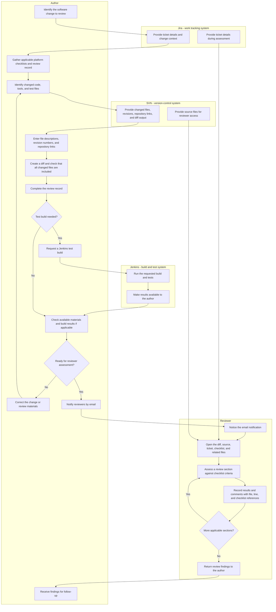
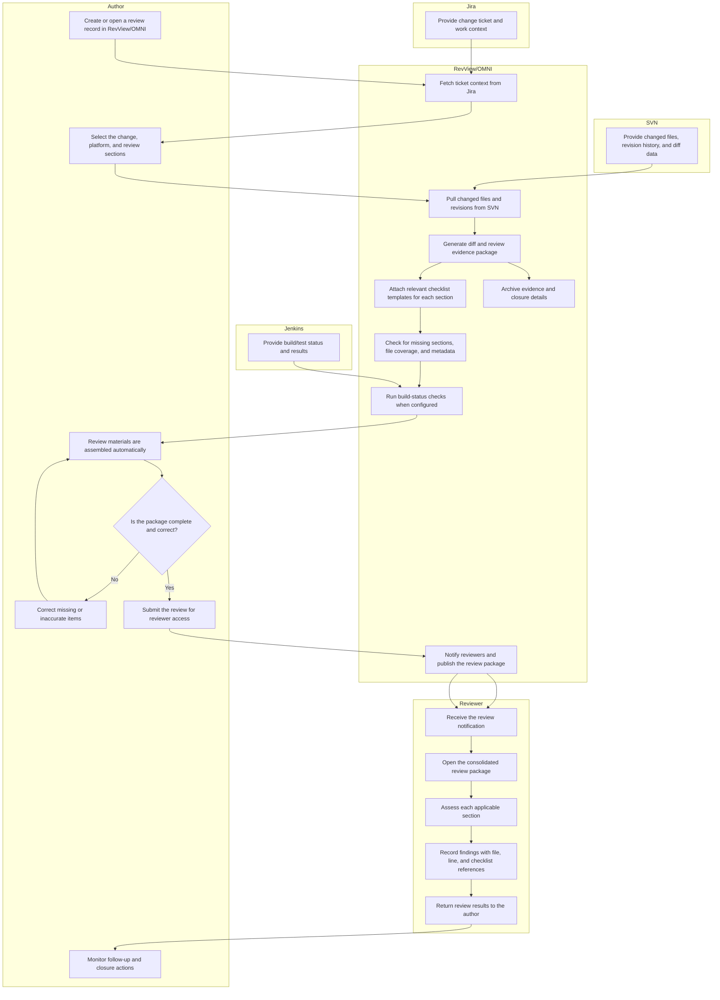
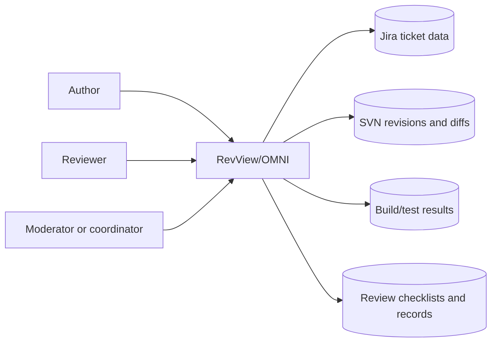

# Vision and Scope

**Project:** _[RevReview OMNI_
**Team:** _[Team 8]_
**Client:** _[Sumalee Rodolph - Applied Avionics]_
**Version:** 0.1

---

_**How to use this template.** Every section below opens with an instruction in italic square brackets: what the section is for, how to produce it, a worked example, and a checklist. Fill in the section underneath the instruction. **Leave the instructions in the file until the document is stable.** They are context for you, for the teammate who writes a later section, and for your AI teammate, which reads this file every time it works on your project._

_**This document has two readers.** Your client has to recognize their own business in it, so avoid jargon they would not use. Your AI teammate has to build from it, so avoid a claim it cannot check. When the two pull against each other, write for the client and put the precision in the use cases._

_**Work it with your agent, not instead of it.** Give the agent this template, your one-page project brief, and your meeting notes, then put it in a role: "You are an experienced business analyst. Using the instructions in this template, draft section X, and list every question you cannot answer from what I gave you." The questions it cannot answer are the point. They go in [OPEN-ISSUES.md](OPEN-ISSUES.md) and they become the agenda for your next client meeting. What the agent cannot do is decide which of its questions deserve your client's limited time, or tell enthusiasm apart from commitment. That judgment is yours._

## Identifiers in this document

_Identifiers here are **name-based slugs**, never numbers._

| Space | Shape | Example |
|---|---|---|
| Business objective | `BO-<slug>` | `BO-grading-time` |
| Success metric | `SM-<slug>` | `SM-submission-rate` |
| Risk | `RI-<slug>` | `RI-cloud-cost` |
| Assumption or dependency | `AS-<slug>` | `AS-client-maintains-stack` |
| Feature | `FEAT-<slug>` | `FEAT-performance-tracking` |

_Coin each slug from the concept itself: short, kebab-case, unique within its space. **Never renumber, rename, or repoint an identifier.** A new item gets a new slug; a retired item keeps its slug and is marked withdrawn. Cite items by identifier, never by position in a list ("the third objective")._

_Why this matters more with an agent than it used to: ask an agent to insert a new objective into a list numbered `BO-1` through `BO-6` and it has two options. Renumber everything, silently breaking every citation in your use cases and your specification, or append out of order. No test you can write detects either one. A slug has neither failure mode, and it tells a reader what the item is at the place it is cited._

## Revision History

| Date | Version | Description | Author |
|---|---|---|---|
| _[2026-09-12]_ | 0.1 | Initial draft from the client brief and first client meeting | _[CongLe]_ |

---

## 1. Introduction

_[This document defines the goals, purpose, and boundaries of the project. It gives every stakeholder a shared understanding of what the software is for and the context it operates in: the business problem being solved, how the software fits into the client's world, and where the line falls between what is in scope and what is not.]_

### 1.1 Background# RevView/OMNI — Vision and Scope

## 1.1 Background

The sponsoring organization operates in aerospace software engineering. Its internal team works on avionics—electronic systems used in aircraft—and software processes associated with aircraft and spacecraft. The team conducts formal code reviews: structured examinations of software changes against defined criteria, with findings and completion information recorded for later inspection. These reviews support safety-critical software, meaning software whose failure could affect safety. The project brief does not identify the organization's name, employee count, locations, or specific commercial products and services. It does establish a review workflow that can cover three platforms, or distinct target systems, and up to nine review sections across software code, development tools, and tests. [R1, §§1–2, 11]

Today, engineers manually assemble information from several systems and documents before a review can begin. Authors prepare spreadsheets, describe changed files, copy version information, generate comparisons of software changes, complete review records, and notify reviewers. Reviewers then move between those materials to understand the changes and document findings. This recurring administrative work takes time away from engineering assessment and creates opportunities for incomplete reviews, outdated source code, and missed notifications. The brief estimates approximately 20 minutes to gather forms and populate fields for each review, excluding the time required for test builds. This is a planning estimate, not a measured operational baseline. [R1, §§2, 10]

RevView/OMNI is proposed as an internal web application that brings review materials into one workspace and automates repetitive preparation and coordination. The business goal is to reduce review setup effort while preserving human judgment and the review artifacts—documents and files retained as evidence of the review—required by the existing process. The brief anticipates reducing setup effort to approximately 9–10 minutes with automation, or 2–5 minutes with automation and artificial intelligence assistance; these estimates require validation with users. Existing checklist and record formats must remain exportable for audits, which are examinations of process evidence. The application supports reviews of safety-critical software but is not itself described as safety-critical. [R1, §§1, 3, 7, 10–11]

The project also provides a senior design opportunity for TCU students to work with sponsoring avionics systems and software engineers. The intended outcome is an application suitable for internal deployment once it meets the organization's acceptance criteria. Students cannot access the production network, so development will use isolated instances of the existing tools and synthetic data, with the internal software team validating integrations against its own systems. This constraint shapes delivery of the product rather than the current review process described below. [R1, §§11–13]

## 1.2 Current Process Flows (As-Is Process Flows)

### Process boundary and evidence

The as-is process is the workflow performed before RevView/OMNI exists. The flow below covers preparation and reviewer assessment of a software change. The **author** is the engineer preparing the change for review; the **reviewer** is the engineer assessing it. Jira is the system holding the work ticket, or record describing the change. Apache Subversion (SVN) is the version-control system storing files and their revision history. Jenkins runs builds and tests; a build converts source files into software that can be checked or executed. [R1, §§1–2]

The brief documents the activities and problems but not a complete current operating procedure. Their exact ordering, the readiness decision, and the handoff of findings back to the author are reconstructed for this flow and require sponsor validation. The brief describes a moderator—a person coordinating review completion—in proposed automation, but does not establish the moderator's current sequence of actions. Current consolidation, approval, archival, and closure steps therefore remain to be confirmed. [R1, §§2, 4, 7, 9]

### Current workflow



The author uses the Jira ticket to establish the change context, gathers the applicable forms, and identifies the affected files. For each file, the author records a description, the SVN revision number identifying its version, and its repository link identifying its location in the version-controlled file store. The author generates a diff—a comparison showing changes between versions—and checks that it includes all changed files. The author completes the review record, the document capturing review details and outcomes, and runs a Jenkins test build when needed. Once the materials are ready, reviewers receive an email notification. Each reviewer opens the supporting resources, examines the applicable sections, and records checklist results and comments referencing the relevant files and lines. The reconstructed flow ends with findings returned to the author; the existing method of submission and subsequent closure procedure are not specified. [R1, §§2, 7]

### Current tools and limitations

| Tool or material | Current use | Limitation in the documented workflow |
| --- | --- | --- |
| Jira | Holds the ticket describing the work and provides change context. | Authors re-enter information available in the ticket; reviewers consult it separately from code and checklists. |
| SVN and source files | Store version history and supply file links, revision numbers, source code, and diffs. | Authors manually collect version details and verify diff coverage. Reviewers can assess outdated code if they do not update their working copy, the local files obtained from SVN. |
| Jenkins | Executes test builds when required. | Authors must perform the build as a separate activity and consult its results while preparing review materials. |
| Excel review checklists | Capture file descriptions, review criteria, and assessment results for affected platforms. | Up to three platform checklists and nine code/tools/test sections make completeness difficult to track. |
| Review records and related documents | Capture review details and provide supporting context. The brief identifies Word documents among the existing review materials. | Information is distributed across separate files, increasing preparation and maintenance effort. The exact review-record template and format were not supplied. |
| Diff files | Show software changes for review and form part of the retained review evidence. | Authors must ensure coverage of all changed files; comments require separate file and line references. |
| Email | Notifies reviewers that they have been added to a review. | Notifications can be overlooked in an inbox, delaying reviewer awareness. |

These tools and limitations are described in the concept brief; no actual checklist, review record, ticket, or build report was supplied for inspection. [R1, §§1–2, 7–8]

### Pain points and business impact

1. **Repeated preparation work delays review start.** Authors copy file links and revision numbers and complete multiple forms using information already held in other systems. The estimated 20-minute setup effort excludes Jenkins build time, so it represents additional administrative work rather than test execution. [R1, §§2, 10]
2. **Fragmented review materials create completeness and version risks.** The brief reports that reviewers may miss one of as many as nine sections or comment on outdated code after failing to update a working copy. For illustration, a reviewer could complete a platform's code section but overlook its test section, or record a “line 42” comment against a version different from the one under review. These examples explain the documented failure modes; the brief provides no incident counts or measured error rates. [R1, §2]

### Project glossary

| Term | Meaning in this project |
| --- | --- |
| As-is process | The workflow people perform before the proposed application exists. |
| Audit | Examination of retained evidence to assess whether the required process was followed. |
| Author | Engineer preparing a software change and its review materials. |
| Avionics | Electronic systems used in aircraft. |
| Build | Conversion of source files into software that can be checked or executed. |
| Diff | Comparison showing changes between file versions. |
| Formal code review | Structured examination of software changes against defined criteria, with recorded findings and completion information. |
| Jira ticket | Work-tracking record describing a change and its associated context. |
| Jenkins | System used to run software builds and tests. |
| Moderator | Person coordinating review completion; the current detailed procedure is not specified. |
| Platform | Distinct target system for which review materials may be required; platform names are not supplied. |
| Repository | Version-controlled store of files and their history. |
| Review artifact | Document or file retained as evidence of review activity. |
| Review checklist | Form listing review criteria and capturing assessment results. |
| Review record | Document capturing review details and outcomes. |
| Review section | Applicable code, development-tool, or test portion of a platform's review. |
| Reviewer | Engineer assessing the software change and recording findings. |
| Revision number | SVN identifier used to identify a version in repository history. |
| Safety-critical software | Software whose failure could affect safety. |
| SVN / Apache Subversion | Version-control system used to store files and revision history and generate required diffs. |
| Working copy | Local files obtained from SVN that must be updated to reflect the intended revision. |

## 1.3 References

| ID | Title | Date | Where obtained and relevance |
| --- | --- | --- | --- |
| R1 | *RevView/OMNI Review Helper Application Concept* | No publication date appears in the document. PDF metadata records creation and modification on August 24, 2026. | User-supplied [team-08-revview-omni.pdf](../team-08-revview-omni.pdf), 11 pages. §§1–2 (pp. 1–2): business context and current workflow; §§3–4 (pp. 2–3): product goal and proposed coordination; §§7–8 (pp. 6–7): review evidence and existing formats; §9 (pp. 7–8): proposed closure; §10 (pp. 8–9): estimated benefits; §§11–13 (pp. 9–11): sponsorship, delivery constraints, and internal validation. |

R1 is the sole source used for this rewrite. Existing forms, screenshots, operating procedures, and tool records are described by R1 but were not provided as separate reference documents. No external standards or vendor documentation were used to infer current business practices.


_[Summarize the rationale and context for the new product, or for the changes to an existing one. Describe the situation that led to the decision to build it.]_

_**Step 1: Describe the business.** Introduce the organization. Cover what it does (industry, products, services), its size (employees, locations), and the goals that relate to the problem you are solving._

_Example: "The client, XYZ Logistics, is a mid-sized shipping company that specializes in last-mile delivery services for e-commerce businesses. The company operates in five major cities, employs 200 delivery staff, and handles over 10,000 deliveries per day. The goal is to optimize delivery efficiency and customer satisfaction."_

_**Checklist:** Would a reader who has never heard of this organization understand what it does and why this project exists?]_

### 1.2 Current Process Flows (As-Is Process Flows)

_[Most projects require everyone involved to have a firm grasp of the business process being created, replicated, or improved. Without that understanding there is little chance users adopt the new solution. Process flows are the most effective model for building it.]_

_**Step 1: Diagram the current process.** Draw the process people execute **today**, before your software exists, as a mermaid flowchart with **one subgraph per actor** (roles, departments, existing systems). Show the sequence of activities, the decision points, and the handoffs between actors._

_Diagrams in this project are authored as mermaid inside the Markdown file, never exported from a drawing tool as an image. A picture of a diagram is invisible to your AI teammate and unreadable in a diff; a mermaid block is text it can read and revise. A skeleton to start from:_

    ```mermaid
    flowchart TD
      subgraph Student
        A[Open the shared spreadsheet] --> B[Type last week's activities]
      end
      subgraph Instructor
        C[Review the updated sheets] --> D{Complete?}
        D -- No --> E[Email the student]
        D -- Yes --> F[Enter the grade in the LMS]
      end
      B --> C
    ```

_**Step 2: Write the prose.** Not every reader reads diagrams. Explain the flow in a paragraph underneath it._

_**Step 3: List the current tools.** Enumerate what the process runs on today (spreadsheets, paper schedules, email, a legacy system) and give the limitation of each._

_Example: "XYZ Logistics relies heavily on Excel spreadsheets for order management. Printed delivery schedules are distributed to drivers daily. These tools lack automation, making the process prone to human error and delays."_

_**Step 4: Name the pain points.** Highlight the inefficient, slow, or error-prone steps, using one or two specific examples rather than a general complaint._

_Inefficiency example: "Manual entry of order details into Excel causes delays and transcription errors. During peak season, order entries pile up, delaying processing and delivery."_

_Time example: "Printing and distributing delivery schedules to drivers takes 2 hours daily, cutting into time available for deliveries."_

_**Step 5: Write for an outsider.** Assume your reader knows nothing about this domain. Define every domain term on first use and add it to the [project glossary](project-glossary.md)._

_**Checklist:** Is the business context clear to someone unfamiliar with it? Does the flow give step-by-step detail? Are all actors and tools described? Are the inefficiencies illustrated with specific examples? Is there a mermaid diagram with one subgraph per actor?]_

### 1.3 References

_[List every document referenced elsewhere in this one: the client's project brief, existing forms and reports, regulations, standards, competing products. Identify each by title, date, and where it can be obtained. The spreadsheet or screenshot your client showed you belongs here.]_

---

## 2. Business Requirements

_[Projects are launched in the belief that creating or changing a product will provide worthwhile benefits for someone. Business requirements describe the primary benefits the new system will provide to its sponsors, buyers, and users. Input comes from the people who know **why** the project is being undertaken: your client, their management, a subject matter expert, a product visionary. Business requirements determine which user requirements get implemented and in what order, so take this section seriously.]_

### 2.1 Business Opportunity or Problem Statement

The client's avionics engineering team is responsible for formal software reviews on safety-critical systems. The current process relies on a mix of Jira tickets, SVN file history, Jenkins build outputs, review checklists, and email notifications. The result is a review-preparation workflow that consumes engineering time before any technical assessment begins. For each review, authors must manually assemble change context, collect file descriptions and SVN revisions, confirm all changed files are represented in the diff, complete the relevant checklist forms, and notify reviewers. The brief estimates this setup work at roughly 20 minutes per review, excluding the time required for build execution.

This effort is not purely administrative; it also creates risk in an environment where review quality matters. If a reviewer misses one of the platform sections, works from out-of-date files, or does not have a complete set of artifacts, the resulting review may not capture the full change effectively. The business opportunity is therefore not only faster review setup, but also more consistent, auditable review evidence with fewer completeness and synchronization failures.

RevView/OMNI is proposed as an internal web application that consolidates the review record, source context, diffs, and build information into a single review workspace. The intended business value is to reduce repetitive setup tasks while preserving the human judgment that determines the quality of the engineering review. The application supports the current safety-critical review process but is not itself a safety-critical system; it is a coordination and evidence-management tool for the review workflow.

### 2.2 Business Objectives

- `BO-review-setup-time`: Reduce review preparation effort from approximately 20 minutes to approximately 9–10 minutes per review through automation of material collection and form population, with validation in pilot reviews.
- `BO-review-completion-rate`: Increase the proportion of reviews that are ready for reviewer assessment without manual follow-up by reducing missing checklist sections, incomplete diff coverage, and stale metadata.
- `BO-review-consistency`: Improve consistency of review artifacts across platforms and review sections so reviewers see the same set of code, test, and tool materials that the author prepared.
- `BO-review-awareness`: Reduce delays between review creation and reviewer action by automating notification and evidence delivery to the appropriate review participants.
- `BO-audit-readiness`: Preserve review evidence in a structured, exportable form that supports audit review and inspection, while maintaining compatibility with current review checklist and record formats.

### 2.3 Success Metrics

- `SM-review-setup-time`: Measure the median time from review creation to ready-for-review status for a representative sample of internal reviews. Baseline today is approximately 20 minutes of manual preparation time before build execution; success is a reduction to 9–10 minutes in the same workflow with automation, and 2–5 minutes when AI-assisted assistance is included, subject to sponsor validation.
- `SM-ready-without-rework`: Measure the percentage of reviews that reach reviewer assignment without requiring manual corrections to missing file descriptions, missing revisions, incomplete diff coverage, or checklist omissions. Baseline is not currently captured in the brief; the project should establish a pilot measurement during internal validation.
- `SM-notification-latency`: Measure the elapsed time between review readiness and reviewer notification. Baseline is email-based notification and manual follow-up; success is a measurable reduction in time-to-awareness, with notification sent as part of the automated process.
- `SM-audit-coverage`: Measure the percentage of reviews whose generated artifacts can be exported or retained in the format required for review evidence and audit inspection without re-keying manual materials. Success is a sustained ability to produce complete review records and supporting evidence for the selected review sections.
- `SM-user-satisfaction`: Measure reviewer and author confidence in the completeness and usability of generated review packages via short post-review feedback or pilot surveys. Success is a positive trend in confidence and reduced perceived effort across repeated reviews.

### 2.4 Vision Statement

| | |
|---|---|
| **For** | avionics engineers and reviewers preparing and assessing software changes |
| **Who** | need a faster, more reliable, and auditable review process for safety-critical software |
| **The** _RevView/OMNI_ | is an internal web application |
| **That** | consolidates ticket context, source and diff information, review checklists, build results, and notifications into one structured review workspace |
| **Unlike** | the current process of manually gathering materials across Jira, SVN, Jenkins, and separate review documents |
| **Our product** | reduces setup effort and review risk while preserving engineering judgment and retaining the evidence required for formal audits |

### 2.5 Proposed Process Flows (To-Be Process Flows)

The proposed to-be process moves the repetitive preparation work into the application and keeps the review decision itself with the human reviewer. The application will read review context from Jira, gather the affected files and revision details from SVN, identify the relevant review sections and checklist forms, assemble a review package, and notify reviewers when it is ready. The author remains responsible for validating the package and confirming the software change is complete, but the system handles the time-consuming collection and assembly steps that currently occur manually.



This to-be flow addresses the manual pain points described in the current process: authors no longer need to copy file and revision details manually, reviewers no longer need to chase materials across different systems, and the review package is assembled as a single consistent artifact. The manual steps that remain are the engineer's actual review judgment, completion decisions, and any governance actions required after the review, because those decisions are based on engineering reasoning and organizational policy rather than automation. The system does not replace the human review process; it reduces the preparation effort and evidence gaps that impede it.

### 2.6 Risks

- `RI-review-coverage-gap`: If the application fails to include all applicable platform sections or changed files, review quality may decline even while review setup becomes faster. (Probability: 0.4, Impact: 9) Mitigation: enforce required-section validation, diff completeness checks, and review-package summaries before publication.
- `RI-integration-failure`: If Jira, SVN, or Jenkins interfaces are incomplete or unstable, the application may not receive accurate context or build results, undermining trust in the package. (Probability: 0.5, Impact: 8) Mitigation: start with read-only integration for the highest-value data sources and validate each interface with synthetic data before deployment.
- `RI-low-adoption`: Engineers may reject the system if it adds effort during the transition or does not fit existing review practices. (Probability: 0.3, Impact: 9) Mitigation: co-design forms and review artifacts with the internal team, pilot with a small set of users, and preserve exportable checklist formats.
- `RI-audit-mismatch`: If the generated records do not align with the organization's required evidence or records retention practices, the tool may be seen as not fit for internal review controls. (Probability: 0.3, Impact: 10) Mitigation: maintain compatibility with existing review artifacts and involve the reviewing organization in acceptance criteria.
- `RI-misplaced-automation`: If AI assistance or automation produces summaries or metadata that are inaccurate, reviewers may rely on unverified content. (Probability: 0.4, Impact: 7) Mitigation: treat AI-generated output as assistive, require human verification, and keep all audit evidence tied to source material.
- `RI-not-building-the-right-thing`: If the project optimizes for tool convenience instead of actual review quality, the effort may be wasted even if the application works technically. (Probability: 0.2, Impact: 9) Mitigation: define the MVP around actual review-preparation pain points and validate success metrics with pilot use.

### 2.7 Business Assumptions and Dependencies

- `AS-jira-access`: Jira will remain the authoritative ticketing system for work context and change metadata during the project and the pilot deployment.
- `AS-svn-access`: The internal team will provide access to representative SVN repositories, revision information, and diff generation for the review process being modeled.
- `AS-jenkins-access`: Jenkins build and test results will remain available in a usable form for review preparation and reporting.
- `AS-review-forms`: Existing review checklists and record formats must remain available for export, comparison, and audit compliance as the product is introduced.
- `AS-isolated-environment`: The project team will work in isolated or synthetic instances of existing tools, because the production network is not available for student development.
- `AS-sponsor-validation`: Internal avionics engineering staff will validate the final workflow, review sections, and evidence requirements against their actual operating procedures before broad deployment.

---

## 3. Stakeholder Profiles and User Descriptions

### 3.1 Stakeholder Profiles

| Stakeholder | Major value or benefit from this product | Attitude | Major features of interest | Constraints | End user? |
|---|---|---|---|---|---|
| Avionics engineering author | Reduces time spent preparing review materials and improves completeness before a review starts | Supportive | Review-package generation, file and revision collection, checklist population, diff verification | Must maintain strict process quality and evidence traceability | Yes |
| Reviewer / assessor | Sees a complete, current, and well-organized package aligned to the applicable review sections | Supportive to cautious | Review package, notification, file and line context, build results, checklist status | Must confirm that the package matches the intended software change and current working copy | Yes |
| Review moderator or coordinator | Can manage review readiness and completion without manual chasing across separate systems | Supportive | Review status, automated notifications, closing steps, evidence archive | Needs to understand who is pending, missing, or out of date | Yes |
| Sponsor / engineering manager | Gains a faster and more consistent review process with audit-friendly artifacts | Supportive | Reductions in setup effort, better completion rates, evidence retention | Focused on internal adoption and process quality | No |
| Internal quality or audit stakeholder | Receives consistent evidence that reviews were completed and tracked according to process expectations | Cautious but interested | Exportable checklists, review records, retained evidence | Requires traceability and compliance with internal procedures | No |
| System maintainer / internal IT support | Needs a deployable internal application with clear operational responsibilities | Neutral to supportive | Deployment model, configuration, integrations, monitoring | Limited access to production network and internal services | No |
| Student development team | Builds a usable system within a project semester while learning the problem domain | Supportive | Working prototype, UI workflow, integration points, validation data | Must work in isolated environments with synthetic or non-production data | Yes |

### 3.2 User Environment

The primary users are internal software engineers working on aerospace-related code changes. Their review activities are performed in a structured engineering environment, often spanning multiple platforms and software review sections. A review can involve up to three target platforms and as many as nine review sections across code, tool configuration, and testing. These review sections must be evaluated against the relevant checklists and supporting evidence, so the users are not simply filling in a generic form; they are coordinating a safety-oriented review workflow with multiple required artifacts.

The work is performed on an engineering schedule and usually involves multiple participants: the author preparing the change, the reviewer assessing it, and potentially a moderator or coordinator ensuring completion. Review preparation is a recurring activity, not a one-time event. The application therefore needs to support repeated use, rapid review assembly, and consistent evidence packaging for many reviews over time.

The users work with established internal systems rather than with an entirely new software stack. Jira remains the change-tracking source, SVN provides the file and revision history, Jenkins provides build validation, and review records are stored as documents and forms. The product must integrate with those systems without replacing them entirely, because the organization relies on them as part of its engineering and evidence chain.

### 3.3 Alternatives and Competition

| Alternative | Strengths | Weaknesses for this client |
|---|---|---|
| Current manual workflow (Jira + SVN + Jenkins + review documents + email) | Familiar, already in use, requires no new software | Slow, fragmented, prone to copy errors, incomplete packages, and missed review items; requires repetitive manual coordination |
| Standalone spreadsheet or document-driven review pack | Easy to create and familiar to engineering staff | Hard to maintain consistency across review sections, difficult to validate coverage, weak integration with source and build evidence |
| Generic issue-tracking or review tool | More structured than ad hoc documents and may support workflow tracking | Likely not aligned to the specific needs of avionics review forms, platform-specific checklists, and evidence retention requirements |
| Custom in-house system built entirely from scratch by the organization | Can match internal procedures exactly | Requires substantial time, maintenance, and governance; not feasible within the current student project scope |

The status quo is the most likely near-term alternative because it requires no additional procurement and matches the team's current habits. RevView/OMNI must therefore offer a materially better review-preparation and evidence experience rather than simply reshuffling the same information into a different interface.

---

## 4. Scope and Limitations

### 4.1 Product Perspective

RevView/OMNI is best understood as an internal coordination and evidence-management application, not as a standalone software development platform. It sits beside the systems the organization already uses for work tracking, version control, and build execution. Its purpose is to collect and assemble the necessary information for a review, validate that the package is complete, and deliver a consistent review record to reviewers.



The system is therefore an integration layer and workflow orchestrator. It does not replace Jira, SVN, or Jenkins; it organizes the information from those sources into a review-specific package and reduces manual work across the review lifecycle.

### 4.2 Major Features and Scope

- `FEAT-review-initiation`: Create and manage a review package tied to a specific change, platform, and applicable review sections.
- `FEAT-context-assembly`: Collect and organize the relevant Jira ticket information, file list, revision numbers, repository links, and associated review context in a single place.
- `FEAT-diff-and-source-prep`: Generate or assemble the diff, supporting source file context, and review evidence required for technical assessment.
- `FEAT-checklist-mapping`: Associate each applicable review section with the correct checklist, review record, and platform-specific criteria.
- `FEAT-integrity-validation`: Detect missing sections, incomplete file coverage, stale metadata, and other obvious review-preparation errors before publication.
- `FEAT-review-notification`: Notify reviewers when a review package is ready and provide access to the same evidence set they need to assess the change.
- `FEAT-evidence-retention`: Preserve review artifacts and completion information in a form suitable for later audit or process inspection.
- `FEAT-admin-and-configuration`: Support configuration of review sections, platform mappings, and internal process options without altering the underlying engineering review rules.

### 4.3 MVP Scope

**In scope for the MVP:**
- `FEAT-review-initiation`
- `FEAT-context-assembly`
- `FEAT-diff-and-source-prep`
- `FEAT-checklist-mapping`
- `FEAT-integrity-validation`
- `FEAT-review-notification`
- `FEAT-evidence-retention`

**Explicitly out of scope for the MVP:**
- `FEAT-admin-and-configuration` (defer more advanced configuration and extensibility until the core workflow is validated in internal pilot use)
- Advanced AI-generated review summarization or automated decision support beyond assisting with evidence assembly (defer because the brief presents AI assistance as optional and the team must first validate the review process and human oversight requirements)
- Full production-grade integration with every possible internal tool variant across all platforms (defer until the sponsorship team confirms exact systems, environments, and acceptance criteria)

The MVP focuses on the core value proposition: reduce review setup effort, improve completeness, and provide a single review package that supports human assessment and audit evidence.

### 4.4 Deployment Considerations

The product is intended for internal deployment within the sponsoring organization's engineering environment, not as a public-facing application. Users will access it through a secure internal web interface, and it will integrate with systems already used for engineering work. Because the project team cannot access the production network, implementation and validation will occur in isolated or synthetic instances of the relevant tools and review data.

Deployment readiness depends on several operational factors: access to Jira, SVN, and Jenkins data in a test or pilot environment; a defined set of review sections and forms used by the organization; internal agreement on how review evidence should be retained; and a clear maintainer for the application after the student team completes the project. These considerations are not just technical; they shape the architecture, integration scope, and acceptable MVP feature set.

The product should therefore be designed for maintainability, clear configuration boundaries, and limited dependency on production-only assumptions. The final delivered system should be easy for an internal engineer to support once the class project ends, with documentation for setup, configuration, operating rules, and maintenance responsibilities.

---
