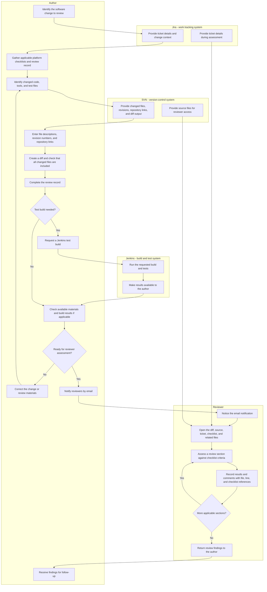

# RevView/OMNI — Vision and Scope

## 1.1 Background

The sponsoring organization operates in aerospace software engineering. Its internal team works on avionics—electronic systems used in aircraft—and software processes associated with aircraft and spacecraft. The team conducts formal code reviews: structured examinations of software changes against defined criteria, with findings and completion information recorded for later inspection. These reviews support safety-critical software, meaning software whose failure could affect safety. The project brief does not identify the organization's name, employee count, locations, or specific commercial products and services. It does establish a review workflow that can cover three platforms, or distinct target systems, and up to nine review sections across software code, development tools, and tests. [R1, §§1–2, 11]

Today, engineers manually assemble information from several systems and documents before a review can begin. Authors prepare spreadsheets, describe changed files, copy version information, generate comparisons of software changes, complete review records, and notify reviewers. Reviewers then move between those materials to understand the changes and document findings. This recurring administrative work takes time away from engineering assessment and creates opportunities for incomplete reviews, outdated source code, and missed notifications. The brief estimates approximately 20 minutes to gather forms and populate fields for each review, excluding the time required for test builds. This is a planning estimate, not a measured operational baseline. [R1, §§2, 10]

RevView/OMNI is proposed as an internal web application that brings review materials into one workspace and automates repetitive preparation and coordination. The business goal is to reduce review setup effort while preserving human judgment and the review artifacts—documents and files retained as evidence of the review—required by the existing process. The brief anticipates reducing setup effort to approximately 9–10 minutes with automation, or 2–5 minutes with automation and artificial intelligence assistance; these estimates require validation with users. Existing checklist and record formats must remain exportable for audits, which are examinations of process evidence. The application supports reviews of safety-critical software but is not itself described as safety-critical. [R1, §§1, 3, 7, 10–11]

The project also provides a senior design opportunity for TCU students to work with sponsoring avionics systems and software engineers. The intended outcome is an application suitable for internal deployment once it meets the organization's acceptance criteria. Students cannot access the production network, so development will use isolated instances of the existing tools and synthetic data, with the internal software team validating integrations against its own systems. This constraint shapes delivery of the product rather than the current review process described below. [R1, §§11–13]

## 1.2 Current Process Flows (As-Is Process Flows)

### Process boundary and evidence

The as-is process is the workflow performed before RevView/OMNI exists. The flow below covers preparation and reviewer assessment of a software change. The **author** is the engineer preparing the change for review; the **reviewer** is the engineer assessing it. Jira is the system holding the work ticket, or record describing the change. Apache Subversion (SVN) is the version-control system storing files and their revision history. Jenkins runs builds and tests; a build converts source files into software that can be checked or executed. [R1, §§1–2]

The brief documents the activities and problems but not a complete current operating procedure. Their exact ordering, the readiness decision, and the handoff of findings back to the author are reconstructed for this flow and require sponsor validation. The brief describes a moderator—a person coordinating review completion—in proposed automation, but does not establish the moderator's current sequence of actions. Current consolidation, approval, archival, and closure steps therefore remain to be confirmed. [R1, §§2, 4, 7, 9]

### Current workflow

The author uses the Jira ticket to establish the change context, gathers the applicable forms, and identifies the affected files. For each file, the author records a description, the SVN revision number identifying its version, and its repository link identifying its location in the version-controlled file store. The author generates a diff—a comparison showing changes between versions—and checks that it includes all changed files. The author completes the review record, the document capturing review details and outcomes, and runs a Jenkins test build when needed. Once the materials are ready, reviewers receive an email notification. Each reviewer opens the supporting resources, examines the applicable sections, and records checklist results and comments referencing the relevant files and lines. The reconstructed flow ends with findings returned to the author; the existing method of submission and subsequent closure procedure are not specified. [R1, §§2, 7]

### Current tools and limitations

| Tool or material | Current use | Limitation in the documented workflow |
| --- | --- | --- |
| Jira | Holds the ticket describing the work and provides change context. | Authors re-enter information available in the ticket; reviewers consult it separately from code and checklists. |
| SVN and source files | Store version history and supply file links, revision numbers, source code, and diffs. | Authors manually collect version details and verify diff coverage. Reviewers can assess outdated code if they do not update their working copy, the local files obtained from SVN. |
| Jenkins | Executes test builds when required. | Authors must perform the build as a separate activity and consult its results while preparing review materials. |
| Excel review checklists | Capture file descriptions, review criteria, and assessment results for affected platforms. | Up to three platform checklists and nine code/tools/test sections make completeness difficult to track. |
| Review records and related documents | Capture review details and provide supporting context. The brief identifies Word documents among the existing review materials. | Information is distributed across separate files, increasing preparation and maintenance effort. The exact review-record template and format were not supplied. |
| Diff files | Show software changes for review and form part of the retained review evidence. | Authors must ensure coverage of all changed files; comments require separate file and line references. |
| Email | Notifies reviewers that they have been added to a review. | Notifications can be overlooked in an inbox, delaying reviewer awareness. |

These tools and limitations are described in the concept brief; no actual checklist, review record, ticket, or build report was supplied for inspection. [R1, §§1–2, 7–8]

### Pain points and business impact

1. **Repeated preparation work delays review start.** Authors copy file links and revision numbers and complete multiple forms using information already held in other systems. The estimated 20-minute setup effort excludes Jenkins build time, so it represents additional administrative work rather than test execution. [R1, §§2, 10]
2. **Fragmented review materials create completeness and version risks.** The brief reports that reviewers may miss one of as many as nine sections or comment on outdated code after failing to update a working copy. For illustration, a reviewer could complete a platform's code section but overlook its test section, or record a “line 42” comment against a version different from the one under review. These examples explain the documented failure modes; the brief provides no incident counts or measured error rates. [R1, §2]

### Project glossary

| Term | Meaning in this project |
| --- | --- |
| As-is process | The workflow people perform before the proposed application exists. |
| Audit | Examination of retained evidence to assess whether the required process was followed. |
| Author | Engineer preparing a software change and its review materials. |
| Avionics | Electronic systems used in aircraft. |
| Build | Conversion of source files into software that can be checked or executed. |
| Diff | Comparison showing changes between file versions. |
| Formal code review | Structured examination of software changes against defined criteria, with recorded findings and completion information. |
| Jira ticket | Work-tracking record describing a change and its associated context. |
| Jenkins | System used to run software builds and tests. |
| Moderator | Person coordinating review completion; the current detailed procedure is not specified. |
| Platform | Distinct target system for which review materials may be required; platform names are not supplied. |
| Repository | Version-controlled store of files and their history. |
| Review artifact | Document or file retained as evidence of review activity. |
| Review checklist | Form listing review criteria and capturing assessment results. |
| Review record | Document capturing review details and outcomes. |
| Review section | Applicable code, development-tool, or test portion of a platform's review. |
| Reviewer | Engineer assessing the software change and recording findings. |
| Revision number | SVN identifier used to identify a version in repository history. |
| Safety-critical software | Software whose failure could affect safety. |
| SVN / Apache Subversion | Version-control system used to store files and revision history and generate required diffs. |
| Working copy | Local files obtained from SVN that must be updated to reflect the intended revision. |

## 1.3 References

| ID | Title | Date | Where obtained and relevance |
| --- | --- | --- | --- |
| R1 | *RevView/OMNI Review Helper Application Concept* | No publication date appears in the document. PDF metadata records creation and modification on August 24, 2026. | User-supplied [team-08-revview-omni.pdf](../team-08-revview-omni.pdf), 11 pages. §§1–2 (pp. 1–2): business context and current workflow; §§3–4 (pp. 2–3): product goal and proposed coordination; §§7–8 (pp. 6–7): review evidence and existing formats; §9 (pp. 7–8): proposed closure; §10 (pp. 8–9): estimated benefits; §§11–13 (pp. 9–11): sponsorship, delivery constraints, and internal validation. |

R1 is the sole source used for this rewrite. Existing forms, screenshots, operating procedures, and tool records are described by R1 but were not provided as separate reference documents. No external standards or vendor documentation were used to infer current business practices.
